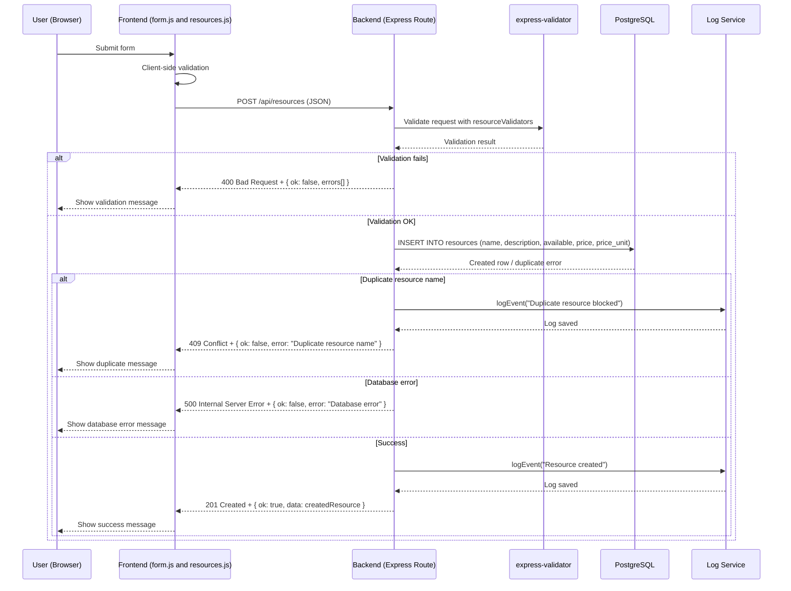
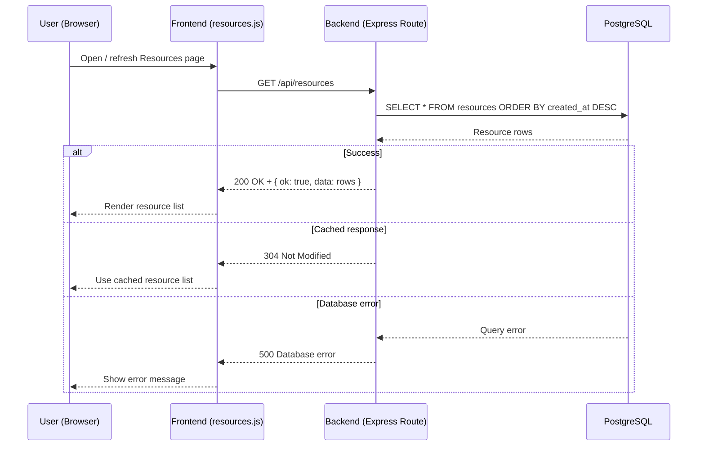
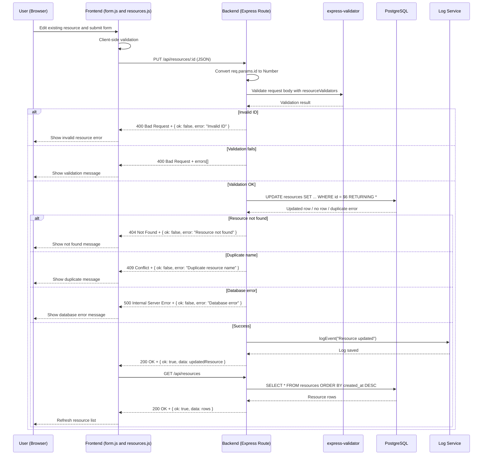
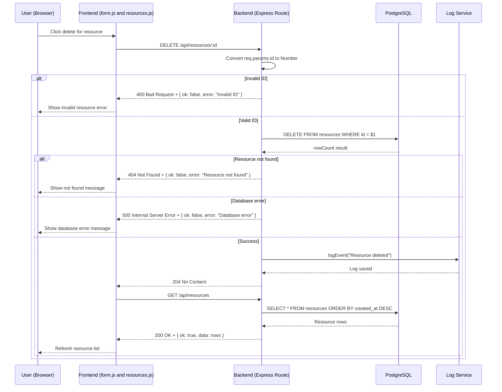

# G1 CRUD Data Flow — Observation Notes

| Operation | UI action | Frontend file | Method | Endpoint | Payload? | Success status | Failure status |
|---|---|---|---|---|---|---|---|
| Create | Submit resource form | form.js / resources.js | POST | `/api/resources` | JSON body | `201 Created` | `400` validation error / `409` duplicate / `500` database error |
| Read | Load resource list | resources.js | GET | `/api/resources` | No request body | `200 OK`; sometimes `304 Not Modified` when cached | `500` database error |
| Update | Edit/save resource | form.js / resources.js | PUT | `/api/resources/:id`, observed `/api/resources/2` | JSON body | `200 OK` | `400` invalid id or validation error / `404` not found / `409` duplicate / `500` database error |
| Delete | Delete resource | form.js / resources.js | DELETE | `/api/resources/:id`, observed `/api/resources/2` | No request body | `204 No Content` | `400` invalid id / `404` not found / `500` database error |

Note: The backend route file confirms the CRUD endpoints. `GET /api/resources` performs `SELECT * FROM resources ORDER BY created_at DESC` and returns `{ ok: true, data: rows }` with status `200`. `GET /api/resources/:id` validates the id, returns `400` for invalid id, `404` if no resource exists, and `200` with one resource when found. Update uses `PUT /api/resources/:id` with `resourceValidators`, updates the row with `UPDATE resources ... WHERE id = $6 RETURNING *`, and returns `200`. Delete uses `DELETE /api/resources/:id`, deletes by id, logs the event, and returns `204 No Content`.

Note: Updating resource id `2` sent a `PUT` request to `/api/resources/2` with `Content-Type: application/json`. The backend returned `200 OK` with a JSON response. After the update succeeded, the frontend also sent `GET /api/resources`, which returned `200 OK`, meaning the UI refreshed/reloaded the resource list.

Note: Deleting resource id `2` sent a `DELETE` request to `/api/resources/2`. The request was initiated from `form.js:154` and returned `204 No Content`, meaning the delete succeeded and the backend did not return a response body. After the delete succeeded, the frontend sent `GET /api/resources`, initiated from `resources.js:434`, and received `200 OK`, meaning the resource list was refreshed after deletion.

# 1️⃣ CREATE – Resource (Sequence Diagram)

# 2️⃣ READ — Resource (Sequence Diagram)

# 3️⃣ UPDATE — Resource (Sequence Diagram)

# 4️⃣ DELETE — Resource (Sequence Diagram)

